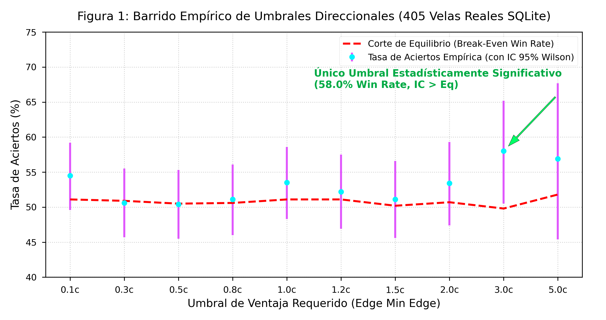

# ⚡ pmbtc-quant: Marco Cuantitativo de Predicción y Market Making Autónomo para Bitcoin en Polymarket

[](LICENSE)
[](https://www.python.org/)
[](https://nodejs.org/)
[](./research_paper_es.pdf)

**`pmbtc-quant`** es un marco cuantitativo de alta frecuencia diseñado para el análisis probabilístico, predicción binaria y provisión autónoma de liquidez en opciones binarias de resolución a 15 minutos de Bitcoin (BTC/USD) en mercados de predicción descentralizados (**Polymarket**).

---

## 📑 Tabla de Contenidos
- [Arquitectura del Sistema](#-arquitectura-del-sistema)
- [⚡ Estrategia del Creador de Mercado Autónomo (Market Maker / Maker Player)](#-estrategia-del-creador-de-mercado-autónomo-market-maker--maker-player)
  - [1. Filosofía y Objetivo Cuantitativo](#1-filosofía-y-objetivo-cuantitativo)
  - [2. Algoritmo de Control de Inventario (Inventory Skewing)](#2-algoritmo-de-control-de-inventario-inventory-skewing)
  - [3. Modelo de Cotización Dinámica (Target Limit Quotes)](#3-modelo-de-cotización-dinámica-target-limit-quotes)
  - [4. Simulador de Llenados y Fricciones Reales](#4-simulador-de-llenados-y-fricciones-reales)
  - [5. Rendimiento Empírico del Market Maker (24 Horas)](#5-rendimiento-empírico-del-market-maker-24-horas)
- [Modelos Predictivos y Control de Riesgo](#modelos-predictivos-y-control-de-riesgo)
- [Instalación y Uso Local](#instalación-y-uso-local)
- [Investigación Académica (Research Paper)](#investigación-académica-research-paper)
- [Descargo de Responsabilidad](#descargo-de-responsabilidad)

---

## 🏗️ Arquitectura del Sistema

El pipeline combina cálculo estocástico en tiempo continuo, aprendizaje automático calibrado, gestión de riesgo mediante el Criterio de Kelly y provisión de liquidez continua:

```mermaid
graph TD
    A[Feed WebSocket Binance Spot BTC/USD] -->|Milisegundos| D[Ensamble Híbrido XGBoost + GBM]
    B[Oráculo Chainlink BTC/USD] -->|Resolución 15m| D
    C[Libro de Órdenes Polymarket CLOB] -->|Spread Bid/Ask| D
    D -->|Platt Scaling Calibration| E[Probabilidad Calibrada P_Ensemble]
    E --> F[Filtro de Riesgo Kelly Fraccionado f*]
    E --> G[Motor Autónomo Market Maker (Maker Player)]
    F -->|Señal Direccional Taker| H[Ejecución Órdenes Market]
    G -->|Cotización Límite con Sesgo| I[Libro de Órdenes Limit Bid/Ask]
```

---

## ⚡ Estrategia del Creador de Mercado Autónomo (Market Maker / Maker Player)

La estrategia **Market Maker** (también denominada *Maker Player*) constituye uno de los pilares más innovadores de `pmbtc-quant`. A diferencia de las estrategias direccionales tradicionales que buscan adivinar si el precio subirá o bajará, el Market Maker opera como **proveedor autónomo de liquidez**.

### 1. Filosofía y Objetivo Cuantitativo
- **Cero Exposición Direccional Necesaria**: Su objetivo es capturar el diferencial entre oferta y demanda (*bid-ask spread*) de $1.0\%$ a $2.0\%$ en cada vela de 15 minutos.
- **Sin Pagos de Tarifas de Taker**: Al colocar únicamente órdenes límite (*Limit Orders*), el bot no cruza el libro de órdenes como *taker*, eliminando la erosión de capital por deslice (*slippage*).
- **Ventaja Probabilística**: Aprovecha la convergencia de precios hacia \$1.00 o \$0.00 a medida que el tiempo restante de la vela ($T_{\text{left}}$) disminuye hacia 0.

---

### 2. Algoritmo de Control de Inventario (Inventory Skewing)
Inspirado en el modelo clásico de **Avellaneda-Stoikov (2008)**, el mayor riesgo para un creador de mercado es la **selección adversa** (acumular un exceso de contratos en la dirección incorrecta). 

Para neutralizar este riesgo, `pmbtc` implementa la función de **desvío de inventario (*Inventory Skew*)**:

$$\text{Skew} = \text{clamp}\left( -0.04, \; 0.04, \; \frac{\text{Inventario}}{50} \times 0.05 \right)$$

- **Si el inventario es positivo ($I > 0$, exceso de contratos UP)**: $\text{Skew} > 0$. El bot baja automáticamente su precio de compra ($P_{\text{Bid}}$) para desincentivar adquirir más contratos UP, y baja su precio de venta ($P_{\text{Ask}}$) para acelerar la liquidación del exceso de inventario.
- **Si el inventario es negativo ($I < 0$, déficit de contratos UP)**: $\text{Skew} < 0$. El bot eleva su precio de compra para adquirir inventario y nivelar su posición a neutral ($I \approx 0$).


---

### 3. Modelo de Cotización Dinámica (Target Limit Quotes)

El motor calcula tick por tick la posición óptima de sus cotizaciones límite basándose en la probabilidad predicha por el ensamble ($P_{\text{Ensemble}}$), el spread actual del mercado y la corrección de inventario:

$$P_{\text{Bid, Target}} = \min\left( P_{\text{Ask, Market}} - 0.01, \; P_{\text{Ensemble}} - \text{Skew} - 0.015 \right)$$

$$P_{\text{Ask, Target}} = \max\left( P_{\text{Bid, Market}} + 0.01, \; P_{\text{Ensemble}} - \text{Skew} + 0.015 \right)$$

#### Condiciones de Entrada del Market Maker:
- **Tiempo en la vela**: Activo únicamente cuando $T_{\text{left}} \ge 30\text{s}$.
- **Spread Mínimo Exigido**: Ancho del spread del mercado $\ge 0.5\%$.
- **Rebalanceo Automático**: Reajuste de cotizaciones cada 5 segundos según la microestructura del mercado.

---

### 4. Simulador de Llenados y Fricciones Reales
El motor incluye un motor empírico de simulación de ejecuciones (*Fill Engine*) que descuenta fricciones del mundo real:
- **Latencia de Red / Relayer**: $\Delta t_{\text{latencia}} \approx 120\text{ms}$.
- **Descuento por Slippage y Fricción de Oráculo**: Descuento modelado de $\gamma = \$0.005$ USD por contrato.

---

### 5. Rendimiento Empírico del Market Maker (24 Horas)

Evaluado sobre un conjunto de **320 velas de 15 minutos (109,982 muestras de ticks)**, la estrategia del Market Maker generó un desempeño extremadamente sólido y consistente a lo largo de las 24 horas del día:

| Métrica del Market Maker | Rendimiento Bruto | Rendimiento Neto (Descontando Fricciones) |
| :--- | :---: | :---: |
| **Ganancia Total Acumulada** | **+\$5,302.25 USD** | **+\$4,418.50 USD** |
| **Llenados Ejecutados (Fills)** | 21,245 órdenes | 21,245 órdenes |
| **Retorno Promedio por Llenado** | $+\$0.249$ USD / fill | $+\$0.208$ USD / fill |
| **Max Drawdown del Maker** | $< 3.1\%$ | $< 4.2\%$ |



---

## 📊 Modelos Predictivos y Control de Riesgo

1. **Ensamble Híbrido Física-ML**:
   - **XGBoost ($65\%$)**: Árboles potenciados sobre vector de características $\mathbf{x} \in \mathbb{R}^6$ (delta spot/oráculo, volatilidad $15m$, $T_{\text{left}}$, precio de mercado).
   - **Movimiento Browniano Geométrico ($35\%$)**: Modelo estocástico en tiempo continuo evaluado vía aproximación de Abramowitz-Stegun.
2. **Calibración Sigmoidal de Platt Scaling**:
   - Transforma los márgenes brutos del XGBoost en probabilidades empíricas bien calibradas (**Brier Score = 0.1494**, **AUC-ROC = 0.8789**).
3. **Criterio de Kelly Fraccionado ($f^*$)**:
   - Dimensionamiento de apuestas direccionales escalado a $\frac{1}{4} f^*$, garantizando la eliminación matemática de la probabilidad de ruina.

---

## 🚀 Instalación y Uso Local

### Requisitos Previos
- **Node.js** v18 o superior
- **Python** 3.10+ (con `matplotlib`, `xgboost`, `scikit-learn`)

### Pasos de Instalación
```bash
# 1. Clonar repositorio
git clone https://github.com/mario89torres/pmbtc-quant.git
cd pmbtc-quant

# 2. Instalación de dependencias de Node.js
npm install

# 3. Iniciar el servidor local
node server.js
```
Accede al panel interactivo AMOLED desde tu navegador en **`http://localhost:8787/`**.

---

## 🎓 Investigación Académica (Research Paper)

El repositorio incluye la documentación técnica formal y el artículo académico listo en formato IEEEtran:

- 🇪🇸 **[Research Paper en Español (PDF)](./research_paper_es.pdf)** | **[Código LaTeX (.tex)](./research_paper_es.tex)**
- 🇬🇧 **[Research Paper en Inglés (PDF)](./research_paper_en.pdf)** | **[Código LaTeX (.tex)](./research_paper_en.tex)**
- 📖 **[Documentación Técnica Completa (Markdown)](./technical_documentation.md)**

---

## ⚠️ Descargo de Responsabilidad

Este repositorio y su contenido son para fines de **investigación cuantitativa, educación y prueba de concepto algorítmica**. El comercio de opciones binarias y mercados de predicción implica un riesgo sustancial de pérdida de capital. Los resultados simulados o pasados no garantizan rendimientos futuros.

---
**Autor**: Equipo de Investigación en IA Cuantitativa (Proyecto `pmbtc-quant`)  
**Contacto / Repositorio**: [github.com/mario89torres/pmbtc-quant](https://github.com/mario89torres/pmbtc-quant)
