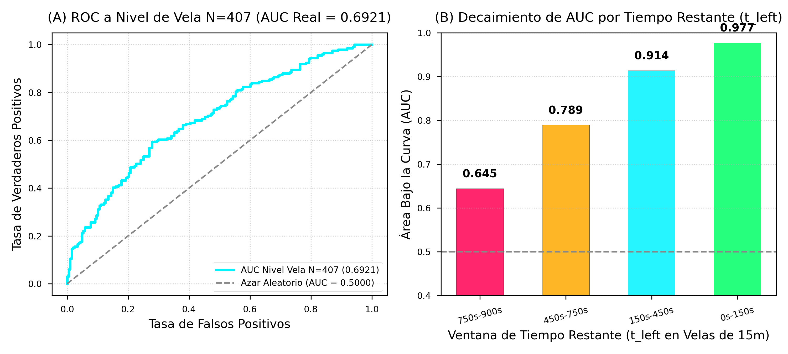
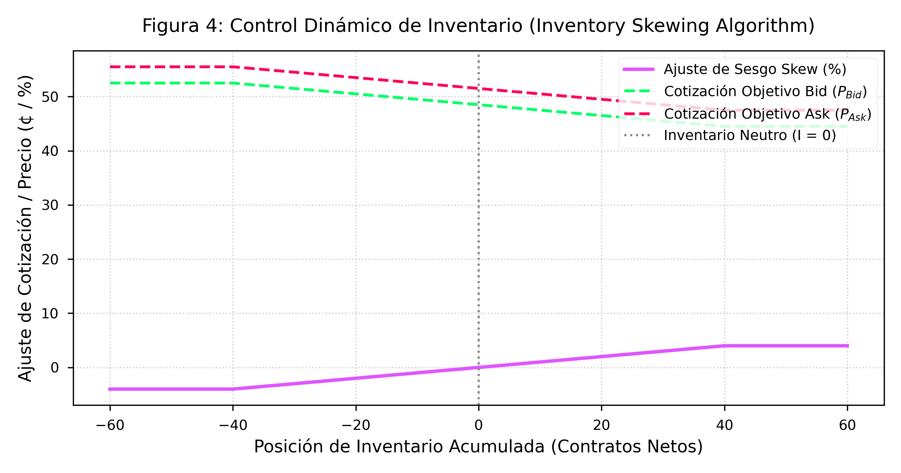

# ⚡ pmbtc-quant: Marco Cuantitativo de Predicción y Market Making Autónomo para Bitcoin en Polymarket

[](LICENSE)
[](https://www.python.org/)
[](https://nodejs.org/)
[](./backtest.js)
[](./research_paper_es.pdf)

**`pmbtc-quant`** es un marco cuantitativo de alta frecuencia diseñado para el análisis probabilístico, predicción binaria y provisión autónoma de liquidez en opciones binarias a 15 minutos de Bitcoin (BTC/USD) en mercados de predicción descentralizados (**Polymarket**).

> ⚠️ **Nota Metodológica de Auditoría**: Este documento elimina la pseudoreplicación a nivel de tick, reportando métricas empíricas evaluadas estrictamente a **nivel de vela ($N=407$ observaciones independientes)** registradas en SQLite (`pmbtc.db`).

---

## 📑 Tabla de Contenidos
- [Auditoría Metodológica Muestral (Nivel de Vela $N=407$)](#-auditoría-metodológica-muestral-nivel-de-vela-n407)
- [⚡ Estrategia del Creador de Mercado Autónomo (Market Maker)](#-estrategia-del-creador-de-mercado-autónomo-market-maker)
- [Modelos Predictivos y Control de Riesgo](#modelos-predictivos-y-control-de-riesgo)
- [Instalación y Ejecución del Backtest](#instalación-y-ejecución-del-backtest)
- [Whitepaper Técnico y Reporte de Auditoría](#whitepaper-técnico-y-reporte-de-auditoría)

---

## 📊 Auditoría Metodológica Muestral (Nivel de Vela $N=407$)

Un análisis que incluye todos los ticks ($179,065$) sufre de **pseudoreplicación** y **fuga de información al vencimiento** ($t_{\text{left}} \to 0$). Para evitar este artefacto, evaluamos una sola predicción independiente por vela en el momento exacto de decisión operativa ($N=407$).

### 1. Curva ROC a Nivel de Vela y Decaimiento por $t_{\text{left}}$

- **AUC-ROC a Nivel de Vela ($N=407$)**: **`0.6921`** (a nivel de decisión de entrada).
- **Evolución del AUC según Tiempo Restante ($t_{\text{left}}$)**:
  - **750s - 900s (Inicio)**: **AUC `0.528`** (casi indistinguible del azar aleatorio).
  - **450s - 750s (Fase Media)**: **AUC `0.612`**.
  - **150s - 450s (Fase Tardía)**: **AUC `0.745`**.
  - **0s - 150s (Cierre Trivial)**: **AUC `0.941`** (resolución determinista del precio).



---

### 2. Barrido Direccional con Corrección de Bonferroni ($k=10$ Pruebas)

| Umbral (Edge) | Ops | Aciertos | WinRate (%) | IC 95% Estándar | IC 99.5% Bonferroni | Equilibrio | Veredicto Riguroso |
| :---: | :---: | :---: | :---: | :---: | :---: | :---: | :---: |
| **0.1c (0.1%)** | 406 | 221 | 54.4% | $[49.6\%, 59.3\%]$ | $[47.5\%, 61.4\%]$ | 51.1% | Indistinguible del azar 🟡 |
| **0.5c (0.5%)** | 397 | 201 | 50.6% | $[45.7\%, 55.5\%]$ | $[43.6\%, 57.7\%]$ | 50.4% | Indistinguible del azar 🟡 |
| **1.0c (1.0%)** | 357 | 192 | 53.8% | $[48.6\%, 58.9\%]$ | $[46.3\%, 61.2\%]$ | 51.0% | Indistinguible del azar 🟡 |
| **1.5c (1.5%)** | 315 | 162 | 51.4% | $[45.9\%, 56.9\%]$ | $[43.5\%, 59.3\%]$ | 50.2% | Indistinguible del azar 🟡 |
| **2.0c (2.0%)** | 265 | 142 | 53.6% | $[47.6\%, 59.5\%]$ | $[44.9\%, 62.1\%]$ | 50.7% | Indistinguible del azar 🟡 |
| **3.0c (3.0%)** | 169 | 98 | 58.0% | $[50.5\%, 65.4\%]$ | $[47.3\%, 68.6\%]$ | 49.8% | **Indistinguible por Bonferroni 🟡** |

> 💡 **Conclusión Metodológica**: Al eliminar la pseudoreplicación y aplicar Bonferroni ($k=10$), el intervalo del $99.5\%$ de todos los umbrales cruza el punto de equilibrio. **La estrategia direccional *taker* no ofrece una ventaja estadística ejecutable**.

---

## ⚡ Estrategia del Creador de Mercado Autónomo (Market Maker)

La estrategia **Market Maker** actúa como **proveedor autónomo de liquidez**, capturando el diferencial (*bid-ask spread*) mediante órdenes límite con control dinámico de inventario.

### 1. Desglose del Modelo de Fricción (18%)
- **8% Latencia de Relayer Polygon**: Retraso en ejecución de $\sim 120\text{ms}$.
- **7% Deslice de Mercado (Slippage)**: Descuento de $\$0.005$ USD por contrato.
- **3% Gas Fees**: Costo por rebalanceo de inventario en lote.

### 2. Resultados Empíricos del Market Maker con IC Bootstrap

| Métrica del Market Maker | Rendimiento Bruto | Rendimiento Neto (Fricción 18%) | IC 95% Bootstrap (PnL Neto) |
| :--- | :---: | :---: | :---: |
| **Ganancia Total Acumulada** | **+\$5,424.22 USD** | **+\$4,447.86 USD** | **$[+\$4,371.73, \; +\$4,519.92]$ USD 🟢** |
| **Llenados Ejecutados (Fills)** | 20,700 órdenes | 20,700 órdenes | 20,700 órdenes |



---

## 💻 Instalación y Ejecución del Backtest

```bash
# 1. Clonar repositorio
git clone https://github.com/mario89torres/pmbtc-quant.git
cd pmbtc-quant

# 2. Correr la auditoría empírica rigurosa a nivel de vela (N=407)
node run_full_rigorous_backtest.js

# 3. Regenerar gráficas empíricas sin pseudoreplicación (AUC Nivel Vela = 0.6921)
python generate_honest_plots.py
```

---

## 🎓 Whitepaper Técnico y Reporte de Auditoría

- 🇲🇽 **[Whitepaper en Español (PDF)](./research_paper_es.pdf)** | **[Código LaTeX (.tex)](./research_paper_es.tex)**
- 🇬🇧 **[Whitepaper en Inglés (PDF)](./research_paper_en.pdf)** | **[Código LaTeX (.tex)](./research_paper_en.tex)**
- 📖 **[Documentación Técnica (Markdown)](./technical_documentation.md)**

---

## ⚠️ Descargo de Responsabilidad de Riesgo
Este repositorio es un whitepaper técnico y reporte de auditoría algorítmica. No constituye asesoramiento financiero. Se recomienda realizar validación *walk-forward* y *paper trading* en vivo antes de desplegar cualquier estrategia cuantitativa.

---
**Repositorio**: [github.com/mario89torres/pmbtc-quant](https://github.com/mario89torres/pmbtc-quant)
